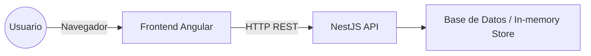

# TCS Challenge – Gestión de Productos Financieros

Una aplicación web para la gestión de productos financieros, desarrollada como reto técnico.  
Permite a los usuarios **visualizar, añadir, editar y eliminar productos** a través de una interfaz intuitiva, con **validaciones en tiempo real** que aseguran la integridad de los datos.

> ⚡ Esta aplicación incluye tanto el **frontend (Angular)** como el **backend proporcionado previamente (NestJS)** necesarios para la gestión de datos.

---

## 🚀 Características Principales

- **Gestión Completa de Productos**: Funcionalidades CRUD (Crear, Leer, Actualizar, Eliminar).
- **Validaciones Robustas**: 
- **Paginación y Búsqueda**: Filtro por nombre o descripción + paginación para eficiencia.
- **Componentes Reutilizables**: Modales, menús contextuales y skeleton loaders.
- **Arquitectura Modular**: Separación en `core/`, `products/`, y `shared/` para escalabilidad.

---

## 🛠️ Tecnologías Utilizadas

### Frontend
- **Angular**: `v18.2.14`
  - **Angular CLI**: `v18.2.21`
- **Node.js**: `v22.12.0`
- **npm**: `v10.9.0`
- **RxJS**: Manejo de datos asíncronos y flujos reactivos.
- **Jest**: Framework de pruebas unitarias.
- **SCSS**: Preprocesador de estilos (metodología BEM aplicada).
- **CSS Nativo**: Sin frameworks externos (Tailwind, Bootstrap, Material).

### Backend
- **NestJS** (Node.js framework).
- Base de datos simulada (in-memory o archivos).
- Scripts de desarrollo con **npm**.

---

## 📂 Estructura del Proyecto
/backend -> API NestJS para la gestión de productos
/frontend -> Aplicación Angular (este repositorio)
/src/app
├── core/ -> Servicios globales, interceptores, validadores
├── products/ -> Lógica y componentes de productos
└── shared/ -> Componentes reutilizables (modales, headers, menús)

---

## 🖼️ Arquitectura General

## Instalación y Ejecución
git clone https://github.com/reaperjason/TCS-challenge.git
cd TCS-challenge

### Backend (NestJS)
cd backend
npm install
npm run start:dev
La API se levantará en http://localhost:3000

### Frontend (Angular)
cd ../frontend
npm install
ng serve
La aplicación se ejecutará en `http://localhost:4200`.
####NOTA: en caso de error al ejecutar npm install, agregar la flag: --legacy-peer-deps

###🧪 Ejecución de Pruebas
npm test
npm run test:coverage

## ✅ Integración Continua (CI)

Este proyecto utiliza **GitHub Actions** para ejecutar pruebas de forma automática en cada **push** y **pull request**.  
El workflow corre los **tests unitarios** y genera el reporte de cobertura.

##👤 Autor
**Carlos Chicaiza**
